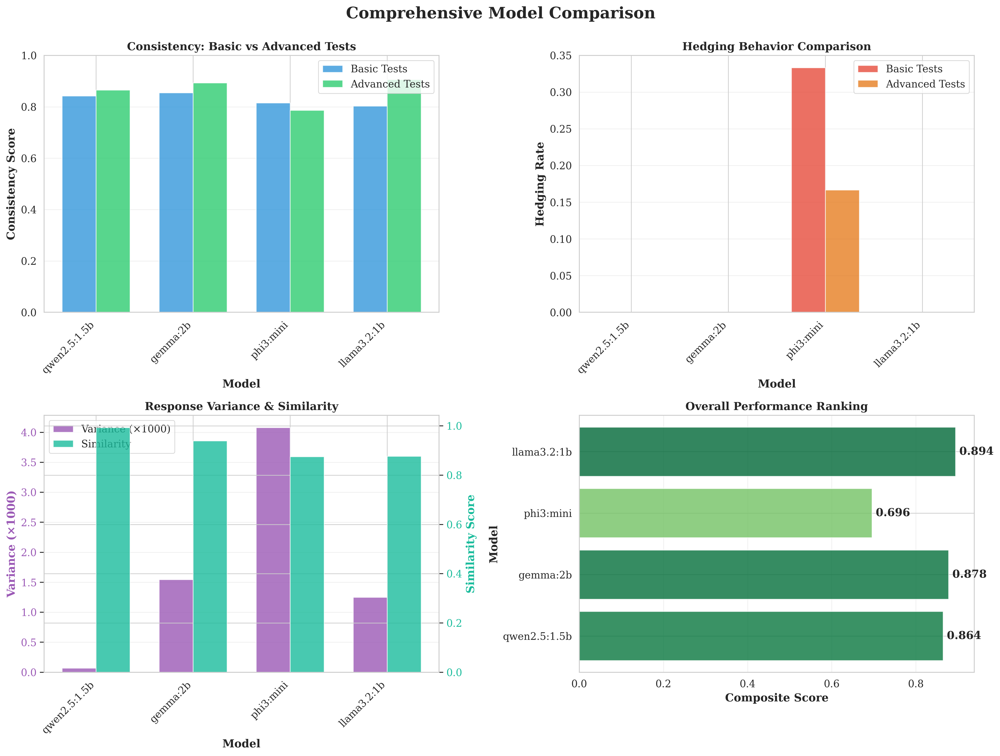
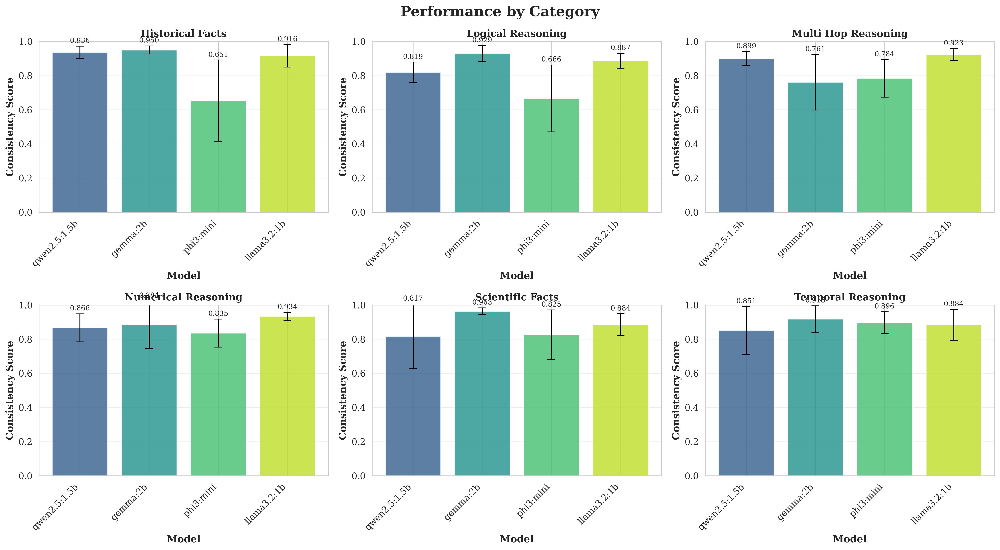
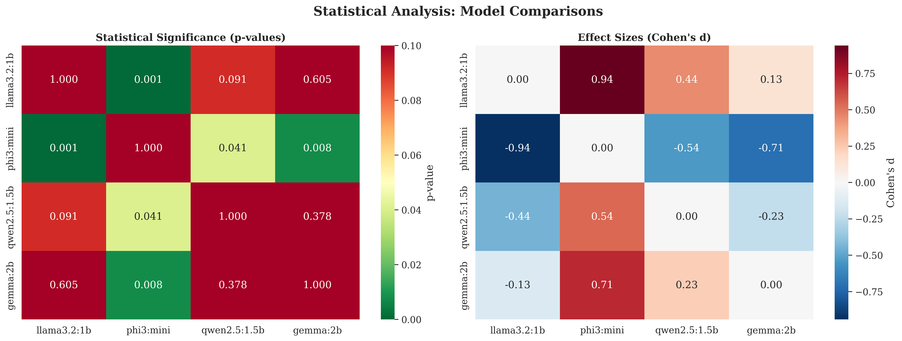

# LLM Failure Evaluation: Testing How Models Break

Most LLM benchmarks tell you when models get things right. This project does the opposite—it specifically tests how and why they fail.

## The Problem

When you deploy an LLM in production, edge cases matter more than average performance. What happens when your model receives contradictory information? Does it hedge appropriately, pick one answer arbitrarily, or try to reconcile the conflict? Standard accuracy metrics won't tell you.

This evaluation framework stress-tests models on scenarios where they're likely to fail: contradictory contexts, multi-hop reasoning chains with conflicting steps, and adversarial paraphrases. The goal isn't to create a leaderboard—it's to understand failure modes so you can make informed deployment decisions.

## What I Built

**30 hand-crafted test cases** spanning six reasoning categories:
- Multi-hop reasoning (chain of inference with conflicting steps)
- Temporal reasoning (timeline conflicts and date calculations)  
- Numerical reasoning (quantitative conflicts requiring precision)
- Scientific facts (domain knowledge with subtle contradictions)
- Logical reasoning (formal logic consistency checks)
- Historical facts (factual accuracy with temporal conflicts)

Each test presents the model with two conflicting contexts, then measures:
- **Consistency**: How semantically similar are responses to Context A vs Context B?
- **Hedging behavior**: Does the model express appropriate uncertainty?
- **Response variance**: How stable are outputs across multiple runs with identical prompts?

## Key Results

I evaluated four models: Llama 3.2 (1B), Phi3 Mini (3.8B), Gemma 2B, and Qwen 2.5 (1.5B).

**Main finding**: Smaller doesn't mean worse. Llama 3.2, despite having the fewest parameters, achieved the highest consistency score (0.894) and showed zero hedging on basic tests. The statistical difference between Llama 3.2 and Phi3 Mini is significant (p < 0.001, Cohen's d = 0.94—a large effect size by any standard).

**Phi3's behavior is interesting**: It hedged in 33% of contradictory context cases compared to 0-17% for other models. This isn't necessarily bad—it might indicate appropriate uncertainty. But if you're building a system that needs confident outputs, Phi3's caution becomes a deployment consideration.

**Performance by difficulty**: All models degrade from easy to hard test cases, which is expected. What's notable is *how* they degrade. Llama 3.2 maintains the smallest performance gap between difficulty levels, suggesting more robust reasoning.

**Category-specific patterns**:
- Logical reasoning proved easiest across all models (0.82-0.92 consistency)
- Historical facts were most challenging for Phi3 (0.651) but fine for others (0.91-0.95)
- Multi-hop reasoning showed the widest variance between models

Full results and statistical analysis in `results/COMPREHENSIVE_EVALUATION_REPORT.md`.

## Why This Matters

**Model selection**: You can't choose models based solely on accuracy benchmarks. A model that scores 85% on MMLU might completely fall apart when given contradictory information. This framework tests that.

**Cost vs reliability**: Llama 3.2 runs faster and cheaper than Phi3, yet performs better on consistency. That's a concrete deployment win.

**Safety-critical applications**: If you're building healthcare chatbots or financial advisors, you need to know how models handle conflicting information. This evaluation directly tests that scenario.

**Debugging in production**: When your LLM misbehaves, you need to know *why*. This framework categorizes failure modes so you can trace root causes.

## Quick Start
```bash
# Install dependencies
pip install -r requirements.txt

# Pull models (requires Ollama)
ollama pull llama3.2:1b
ollama pull phi3:mini
ollama pull gemma:2b
ollama pull qwen2.5:1.5b

# Run evaluation (takes ~45-60 minutes for all models)
cd experiments
python run_evaluation.py

# Generate analysis and plots
cd ..
python notebooks/analysis.py
```

Results save to `results/metrics/` as JSON. Visualizations export to `results/visualizations/`.

## Project Structure
```
llm-failure-eval/
├── src/
│   ├── generators/          # Test case generation
│   │   ├── contradictory_context.py
│   │   └── advanced_test_cases.py
│   ├── evaluators/          # Metrics and analysis
│   │   ├── consistency_scorer.py
│   │   ├── contradiction_detector.py
│   │   ├── advanced_metrics.py
│   │   └── statistical_analyzer.py
│   └── models/              # Model API wrappers
│       └── hf_client.py
├── experiments/
│   └── run_evaluation.py    # Main evaluation pipeline
├── notebooks/
│   └── analysis.py          # Results analysis and visualization
└── results/                 # Outputs and reports
```

The code is deliberately modular. Adding a new test category takes 10 lines:
```python
generator.test_cases.append({
    "category": "medical_reasoning",
    "context_a": "Drug X causes nausea in 10% of patients",
    "context_b": "Drug X causes nausea in 30% of patients",
    "question": "What's the nausea rate for Drug X?",
    "expected_conflict": True
})
```

## Technical Implementation

**Statistical rigor**: Beyond just comparing means, I ran t-tests for significance, calculated Cohen's d for effect sizes, and performed ANOVA across categories. The goal was to quantify practical differences, not just find p < 0.05.

**Semantic similarity**: Used sentence-transformers to measure response consistency. This catches cases where models say the same thing in different words (or vice versa).

**Local deployment**: Everything runs on Ollama locally. No API costs, no data leaving your machine. This matters for sensitive applications.

**Extensibility**: The framework is model-agnostic. Swap in OpenAI's API, Anthropic's Claude, or any other model by changing one file (`src/models/`).

## Sample Visualizations

The analysis pipeline generates publication-quality plots:


*Overall model comparison across consistency, hedging, variance, and composite performance*


*Performance by reasoning category with error bars*


*Pairwise comparisons showing p-values and effect sizes*

## Limitations and Future Work

This is a diagnostic tool, not a replacement for comprehensive benchmarks. 30 test cases is enough to surface patterns but not enough for definitive claims about model superiority.

The framework assumes contradictory contexts are inherently problematic. In reality, some domains (e.g., legal reasoning, philosophical debates) require nuanced handling of conflicting information. Future versions should separate "failure to reconcile" from "appropriate hedging."

Statistical tests assume independence between test cases, which isn't strictly true—some categories are conceptually related. Treating this as exploratory analysis rather than confirmatory hypothesis testing.

## Use Cases

**Before deploying a model**: Run this evaluation to understand failure modes specific to your domain. Add custom test cases that mirror real user queries.

**Comparing models**: When choosing between Llama, Mistral, or GPT variants, this framework quantifies how they handle edge cases beyond standard benchmarks.

**Monitoring production systems**: Re-run evaluations periodically to catch model drift or unexpected behavior after updates.
